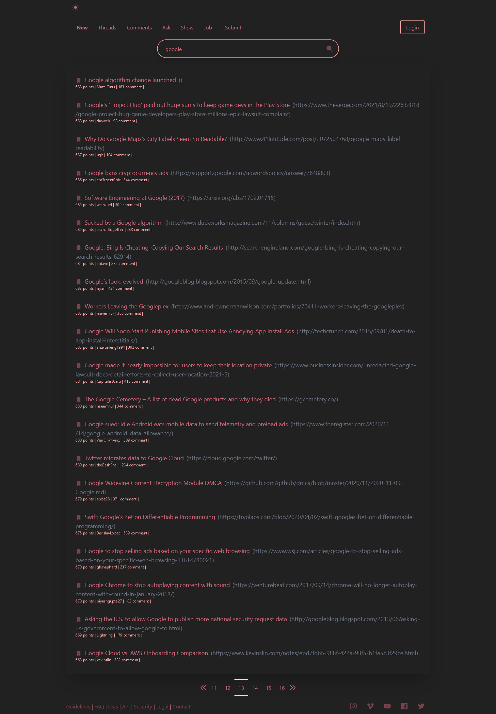

  
#  Description

This project is a clone of Hacker news rewritten with React and styled with Tailwind CSS.
using Algolia's API.


# How To Start

This project was bootstrapped with Create React App.

Below you will find some information on how to perform common tasks.

## Installation

- Clone the repository into your projects directory :

- Use the package manager `yarn` or `npm` to install Hacker News.


Install hacker-news with `yarn`

```bash 
  yarn add
  cd hacker-news
```

Alternatively you may use npm:

```bash 
  npm install
  cd hacker-news
```

In the project directory, you can run:

`yarn start`
or
`npm start`


## Installing a Dependency


The generated project includes React and ReactDOM as dependencies. It also includes a set of scripts used by Create React App as a development dependency. You may install other dependencies (`React axios ` , `styled-components`) with `yarn`:


```bash
yarn add axios
```

```bash
yarn add styled-components
```
## Featuring
React - (UI Framework)

Tailwind - (CSS Framwork)

Bable - (Module Bundler)

ESLint - (Coding Best Practices/Code Highlighting)

Optional - Yarn or npm Package Manager


## Contributing
Pull requests are welcome. For major changes, please open an issue first to discuss what you would like to change.
## Screenshots



  
